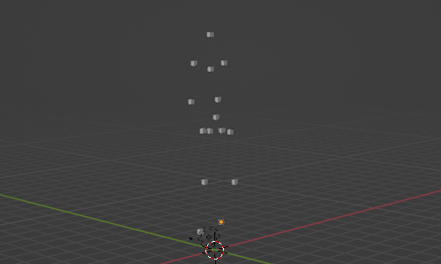
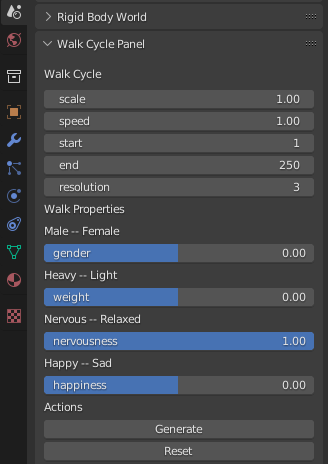
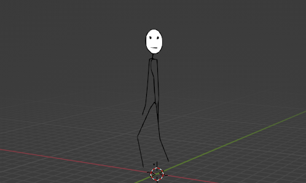

# PoMoCap - PoseNet Motion Capture in Blender


The synchronization of the three panes in the video above is not fine-tuned,
because...
But it shows the general idea and the process of this little project.

The google-coral
[PoseNet](https://github.com/tensorflow/tfjs-models/tree/master/pose-detection)
model as described in [this](https://arxiv.org/abs/1803.08225) research paper,
is the work horse of the project. It maps $x,y$ coordinates of body parts,
as for instance, nose, left/right knee, left/right ankle, etc. to positions in
images or videos.

We feed these coordinates into blender to set the location of bones with
location keyframes. The mid pane in the video shows the identified body parts
of the classifier. The left pane shows cubes that are added and moved according
to the provided $x,y$ coordinates and in the right pane, we added copy
constraints on the cubes to the armature of the stick figure.

Of course, this is only a rough demonstration:

* The armature and the cubes are not scaled properly.
* Not all bones of the stick figure are mapped to corresponding cubes
* The armature of the stick figure behaves strangely, due to rotation issues 
(see for instance, the hands or the bend of the chest line)

However, it is really satisfying to see such an idea come to life.

# The Why- question

For informal presentations, as for instance in front of colleagues or students,
I like to loosen up the content by small [XKCD](https://xkcd.com/) like 
animations.


Sometimes they just say "Hellooo", as the one above, but sometimes they
destroy my ideas with a jackhammer.

When I prepared the annual PhD status presentation, I needed some of them,
carrying boxes of dynamite to a bridge to make a huge explosion. Naturally,
this involved a lot of animation work. Work that I do not really master.

I was always looking for some way to employ  motion capture techniques to
animate the movements of the stick figures. At some point I stumbled over the
Kinect ecosystem with the open 
source [library](https://openkinect.org/wiki/Main_Page) and thought it would be 
fun to play with it. But I never came around to get one.

Then I stumbled again. This time over a 
[research paper](https://arxiv.org/abs/1803.08225) that more or less provides
all the information the kinect can provide, but without the kinect. Obviously
I finally reached the initial hurdle, that was low enough to be my gateway
in the world of crappy motion capturing and the result can be seen above.

Note, that the actual work is done by the authors of the paper. I just feed
the results of their classification model into blender and click play in the
timeline to see the magic happen.

When we journey through unexplored territory, we tend to learn a lot. One thing
I learned was that I actually do not have much of a problem with animation work,
but with the animation of walk cycles. This is because, the synthesis of 
natural motion requires a lot of experience. Experience, that I do not have.

On the other hand the Posenet model is meant to capture the pose of people
facing the camera. A walkcycle from the side, that I require to make my stick
persons walk cannot be easily captured. Instead of painstakingly setting the
keyframes for the animation of a walk cycle, I wondered if I can do it
programmatically. Of course, there was only one secret weapon in my arsenal,
that would have the power to do that... Python.


# Walk Cycle Plugin for Blender



The upper image looks not very fluid, but this is only because of the GIF
generation. Open `running_walker.blend` in blender to see how smooth the walk
cycle is.

My first experiment was to programmatically set the keyframes of walk motions,
that I eyeballed from a reference image and the result was stunningly... crappy.

I looked for scientific papers, that research biological motion of humans and
stumbled (again!!) over Nikolaus Trojes 
[paper](https://jov.arvojournals.org/article.aspx?articleid=2192503).
He used motion capture hardware to record the gait patterns of 40 people.
Thereby 15 points (head, neck, shoulders, hips,...) were tracked with a 
resolution of 120 Hz around 12s. He then used PCA to derive eigenvectors of
the covariance matrices of the sample data and linear classification to
identify control variables, that can be considered as walk properties (as
for instance gender, happiness, nervousness, weight,...). An interactive
example is presented [here](https://www.biomotionlab.ca/html5-bml-walker/).



The controls of the plugin are self explanatory. The *Generate* button will
create keyframes in the range of the *start* and *end* frame with a resolution
of 3 in the upper example. For the time computation, the plugin consideres the
frames per second, that are configured in the render panel. With reset the
key_frames will be removed and the armature will be reset to initial position.



Of course, again not polished. I just threw copy location constraints on the
bones of the stick figure. 

# You want to use it? - Beware the dragons

## For using the motion capturing approach

Lets assume you have a video `pose.mp4` from which you want to capture the 
motion.

Then best start by separating the video into images:

```
ffmpeg -i pose.mp4 -r 1 --resize 257x257 pose/pose%05d.jp
```

You can improve the resolution of your later animation by exracting more images
per second. Adjust `-r ` option accordingly.

Then use the `mocap/index_video.js` file to derive a `output.json` file. This
will contain the x,y position of the body markers. You can check the detection
quality by checking the *score* values. If the *score* values are too low there
will be no usable motion capture information.

Now open blender in the scripting workspace. There you open the script
`mocap/poseVidAdd.py` and adjust the input open path:

```
with open('<my_path_to>/output.json', 'r') as f:
```

Execute the script and maybe, just maybe you have copied the motion from the
video to blender. 

## For using the walk cycle addon

Ideally you can install the zip from the release page as blender addon. 

You need to specify the path `Data File path` in the addon
preferences, which must point to the
directory of the addon or at a directory, that contains the file `data.json`.

Then the panel of the plugin is registered in the scene properties.